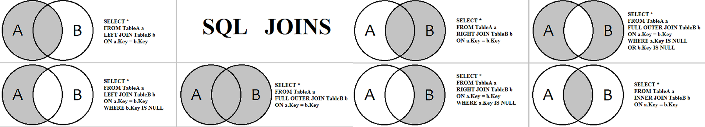

# SQL Joins

Reference: [PostgreSQL Join](https://www.postgresql.org/docs/current/tutorial-join.html)

<!-- markdownlint-disable MD033 MD045 -->


## 1. Cross Join

Reference: [A Visual Explanation of SQL Joins](https://blog.codinghorror.com/a-visual-explanation-of-sql-joins/),

The CROSS JOIN query in SQL is used to generate all combinations of records in two tables. Every row from the first table is paired with every row from the second table.

```sql
SELECT * FROM table1 CROSS JOIN table2;

-- Also produces a Cartesian product
-- a WHERE clause can be used to filter the Cartesian product,
-- effectively turning it into an INNER JOIN.
SELECT * FROM table1, table2;
```

## 2. Inner Join (Default)

An INNER JOIN is used to retrieve rows from two or more tables that have matching values in a specified common column or columns. It is functionally identical to JOIN. The INNER keyword is optional because it is the default type of join when no specific join type is provided.

## 3. Left Join/Left Outer Join

A LEFT JOIN returns all records from the left table and the matched records from the right table. If no match is found for a row in the left table, the columns from the right table will contain NULL values in the result set.

For example: Listing all customers and their orders, even if they haven't placed any

```sql
SELECT select_list
FROM table1 -- Left table
LEFT JOIN table2 -- Right table
ON table1.column_name = table2.column_name;
```

## 4. Right Join/Right Outer Join

A RIGHT JOIN works in reverse of a LEFT JOIN: it returns all records from the right table and the matched records from the left table. If no match is found for a row in the right table, the columns from the left table will contain NULL values.

For example: Listing all products and their associated sales info, even if some products haven't sold

```sql
SELECT select_list
FROM table1 -- Left table
RIGHT JOIN table2 -- Right table
ON table1.column_name = table2.column_name;
```

## 5. Full Join/Full Outer Join

Returns all records from both tables, combining the results of both a LEFT OUTER JOIN and a RIGHT OUTER JOIN.

## 6. Self Join

```sql
SELECT e2.name
FROM Employee e1
JOIN Employee e2 ON e2.id = e1.managerId
GROUP BY e1.managerId
HAVING count(e1.id) >= 5
```
