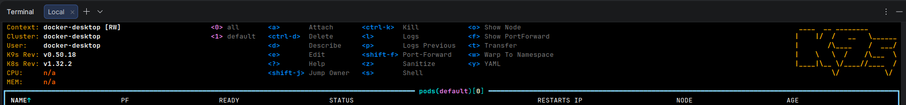

# Environment Setup


## K3s - Lightweight Kubernetes

Reference: [K3s Quick-Start Guide](https://docs.k3s.io/quick-start)

K3s provides an installation script that is a convenient way to install it as a service on systemd or openrc based systems.

- Additional utilities will be installed including kubectl
- A single-node server installation is a fully-functional Kubernetes cluster, including all the datastore, control-plane, kubelet, and container runtime components necessary to host workload pods

```sh
curl -sfL https://get.k3s.io | sh -
```

To install additional agent nodes and add them to the cluster, run the installation script with the K3S_URL and K3S_TOKEN environment variables.

```sh
sudo cat /var/lib/rancher/k3s/server/node-token
curl -sfL https://get.k3s.io | K3S_URL=https://myserver:6443 K3S_TOKEN=mynodetoken sh -
```

## Vault - Secrets Manager

Reference: [Vault on Kubernetes deployment guide](https://developer.hashicorp.com/vault/tutorials/kubernetes/kubernetes-raft-deployment-guide)

```sh

```

## K9s - Kubernetes TUI

Reference: [K9s Installation](https://k9scli.io/topics/install/)

```shell
# Install Homebrew
/bin/bash -c "$(curl -fsSL https://raw.githubusercontent.com/Homebrew/install/HEAD/install.sh)"

# Add Homebrew to PATH
test -d ~/.linuxbrew && eval "$(~/.linuxbrew/bin/brew shellenv)"
test -d /home/linuxbrew/.linuxbrew && eval "$(/home/linuxbrew/.linuxbrew/bin/brew shellenv)"
echo "eval \"\$($(brew --prefix)/bin/brew shellenv)\"" >> ~/.bashrc

# Install K9s via Homebrew
brew install derailed/k9s/k9s
```

## ArgoCD - GitOps Tool

Reference: [Getting Started](https://argo-cd.readthedocs.io/en/stable/getting_started/)

In most deployments, Argo CD is installed only once, usually in the `argocd` namespace, while applications are deployed into differents environments

```shell
kubectl create namespace argocd
kubectl apply -n argocd -f https://raw.githubusercontent.com/argoproj/argo-cd/stable/manifests/install.yaml

# grant access to other namespaces
kubectl label namespace dev  argocd.argoproj.io/managed-by=argocd
kubectl label namespace prod argocd.argoproj.io/managed-by=argocd

# get default admin password
kubectl -n argocd get secret argocd-initial-admin-secret -o jsonpath="{.data.password}" | base64 -d
```

By default, Argo CD's API server is not exposed outside the cluster. For development purposes, use kubectl port-forward to expose ArgoCD API Server

```sh
kubectl port-forward --address 0.0.0.0 svc/argocd-server -n argocd 8080:443
```

## Helm - Package Manager

Reference: [Installing Helm](https://helm.sh/docs/intro/install/)

Helm now has an installer script that will automatically grab the latest version of Helm and install it locally.

```sh
curl -fsSL -o get_helm.sh https://raw.githubusercontent.com/helm/helm/main/scripts/get-helm-4
chmod 700 get_helm.sh
./get_helm.sh
```

## Docker & Kubernetes Desktop - Development Environment

Go read their docs mate!

